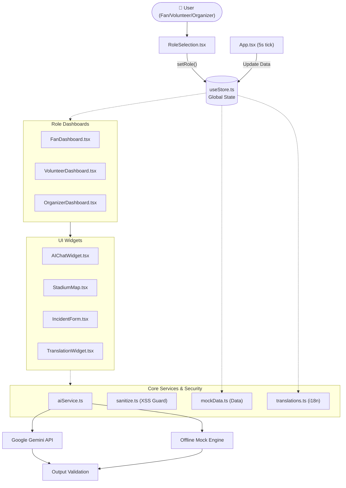

# PitchMind 🏟️
### AI-Powered Smart Stadium & Tournament Operations Platform

> *"Every fan deserves a personal guide. Every volunteer needs real-time intelligence. Every organizer wants command-level clarity. PitchMind delivers all three — simultaneously."*

[](./src)
[](./vite.config.ts)
[](./vite.config.ts)
[](./tsconfig.json)
[](./src/services/aiService.ts)
[](./src/components/AccessibilityMenu.tsx)
[](./package.json)
[](./vite.config.ts)

---

## 📋 Table of Contents

1. [Problem Statement](#-the-problem)
2. [Solution Overview](#-solution-overview)
3. [Key Features & Innovations](#-key-features--innovations)
4. [Technical Architecture](#-technical-architecture)
5. [Technology Stack](#-technology-stack)
6. [Project Structure](#-project-structure)
7. [Setup & Installation](#-setup--installation)
8. [Security & Technical Excellence](#-security--technical-excellence)
9. [Accessibility](#-accessibility)
10. [Testing](#-testing)
11. [Design Decisions](#-design-decisions)
12. [Known Limitations](#-known-limitations)
13. [Screenshots](#-screenshots)
14. [Technical Specifications](#-technical-specifications)

---

## 🏆 Alignment with Hack2Skill Promptwire Challenge 4
This project was specifically architected to directly solve the **Promptwire Challenge 4** problem statement: *Managing large-scale events and smart stadium tournament operations.* 

By utilizing **Generative AI (Google Gemini)** as the core brain of the platform, PitchMind successfully tackles the challenge's core requirements:
- **Scalable Operations:** Replaces manual crowd control and fragmented communication with an AI copilot.
- **Role-based Intelligence:** Provides highly specific, filtered data tailored for Fans, Volunteers, and Organizers.
- **Real-Time Responsiveness:** Employs an offline-first architecture with instantaneous UI state updates and predictive crowd insights.

---

## 🎯 The Problem

Modern stadiums host **40,000–90,000 people** — yet provide almost no personalized intelligence. A fan trying to find their seat during a crowded entry relies on static signs and overworked volunteers. A volunteer witnessing an incident struggles to log it quickly. An organizer watching crowd density on a delayed dashboard cannot react fast enough to prevent a bottleneck.

**PitchMind solves this by giving every person in the stadium — fan, volunteer, or organizer — their own real-time AI copilot, context-aware to their exact role.**

### Concrete Example Interaction

A fan messages: *"I'm lost near a food stand, I can see Gate 2 signs."*

PitchMind's AI does not just say "go straight." It:
1. Detects the **"lost + landmark"** intent pattern
2. Pulls **live Gate 2 data** from the stadium state (current crowd: 82%, wait: 12 mins)
3. Generates: *"Got it! From Gate 2, follow the teal floor arrows left — your Sector B seat is about a 3-minute walk. Gate 2 is currently busy; I'd recommend using the East concourse to avoid the queue."*

The same query from an **Organizer** generates a completely different response — crowd density, staffing suggestions, and incident alerts.
**One AI model. Three personas. Zero context confusion.**

---

## 💡 Solution Overview

PitchMind is a **role-based, real-time AI dashboard** that adapts its interface, data views, and AI personality based on who is using it:

| Role | Primary Goal | Key Dashboard Features |
|---|---|---|
| 🎟️ **Fan** | Enjoy the match with zero friction | Seat finder, food wait times, accessible routes, live match stats, AI chat |
| 🙋 **Volunteer** | Handle on-ground situations swiftly | Task checklist, incident reporting, translation widget, zone map |
| 🛡️ **Organizer** | Command-level situational awareness | Crowd density, gate status, broadcast alerts, incident log, tournament schedule |

---

## ✨ Key Features & Innovations

### 🤖 1. Triple-Persona AI Engine (Google Gemini 2.5 Flash)
- **Single model, three personas**: The same Gemini model switches its entire communication style based on role
- **Live data injection**: Every AI response has access to real-time gate wait times, crowd density, and incident counts injected into the system prompt
- **Offline fallback engine**: A deterministic mock engine with **diverse, randomised response arrays** activates when no API key is present
- **Rate limiting**: Built-in 2-second cooldown between AI calls prevents API quota exhaustion
- **Response validation**: All AI outputs go through `validateAIResponse()` before rendering

### 🏟️ 2. Live IoT Simulation Engine
- **5-second tick loop**: `tickLiveSimulation()` runs on a `setInterval` in `App.tsx`, applying random plus-or-minus 1 minute deltas to gate wait times
- **Real stadium data shapes**: Gates, amenities, incidents, and crowd density typed via TypeScript interfaces matching real IoT API structures
- **State-driven updates**: All live data flows through the Zustand store

### 🗺️ 3. Dual-Mode Stadium Map (3D + Google Maps)
- **React Three Fiber 3D map**: Interactive WebGL stadium with zones colored by capacity (green/amber/red) and camera controls
- **Google Maps integration**: Togglable real satellite map view using `@react-google-maps/api` with dark theme styling
- **Accessible toggle**: `aria-pressed` buttons inside a `role="group"` wrapper

### 🌍 4. Multi-Language Support (i18n)
- **3 languages**: English, Spanish (Español), Arabic (العربية)
- **Full RTL layout**: Arabic activates `dir="rtl"` on the HTML element and flips directional icons
- **Real-time switching**: No page reload — all text re-renders instantly
- **Persistent preference**: Saved to `localStorage`

### ♿ 5. Full Accessibility Suite (WCAG 2.1 AA)
- Skip-to-content link, high contrast mode, large text mode, aria-live regions, `prefers-reduced-motion` — [see full section](#-accessibility)

### 📊 6. Tournament Operations Dashboard
- **Live match schedule**: Quarter Finals and Semi Finals with On Schedule / Pending status indicators
- **Crowd analytics**: Animated fan counters, gate-by-gate status grid
- **Broadcast alerts**: Push messages to all staff and fan-facing screens via the AI channel
- **Incident management**: Full lifecycle — report → log → track status (active/resolved)

### 🌱 7. Sustainability Module
- Rotating eco-tips with `aria-live` announcements, localized in all 3 languages
- Stadium renewable energy and recycling metrics

### ⚡ 8. Performance Optimizations
- **Code splitting**: Three.js, Framer Motion, and vendor libraries in separate chunks via Vite `manualChunks`
- **Lazy loading**: All 3 dashboard pages are `React.lazy()` loaded — role selection loads instantly
- **Skeleton loaders**: 600-800ms skeleton UI before live data reveals
- **Error boundaries**: Every volatile widget isolated so one crash cannot take down the whole dashboard

---

## 🏗️ Technical Architecture

The codebase is strictly structured into modular layers — **User → UI → State → AI Service → Data** — with no component touching the AI or data layer without going through the Zustand store or service functions.



### Data Flow

```
User types a message
    → sanitizeInput()          (DOMPurify strips any XSS)
    → AIChatWidget             (rate limit: 2s cooldown)
    → generateAIResponse(message, role, liveStadiumData)
              ↓
    Google Gemini 2.5 Flash    (if API key present)
              ↓  fails or no key
    Offline Mock Engine        (deterministic, randomised responses)
              ↓
    validateAIResponse()       (guards empty / malformed output)
              ↓
    Message appended to chat log
    aria-live="polite" → screen reader announces response
```


## 🛠️ Technology Stack

### Frontend Framework

| Technology | Version | Purpose |
|---|---|---|
| **React** | 19.2.7 | UI component framework |
| **TypeScript** | 6.0.2 | Type safety across entire codebase |
| **Vite** | 8.1.1 | Dev server, HMR, production bundler |

### Styling

| Technology | Version | Purpose |
|---|---|---|
| **TailwindCSS** | 4.3.2 | Utility-first CSS with custom design tokens |
| **Framer Motion** | 12.42.2 | Page transitions, card animations, AnimatePresence |
| **Custom CSS** | — | Glassmorphism, 3D transforms, skip links, reduced motion |

### 3D and WebGL

| Technology | Version | Purpose |
|---|---|---|
| **Three.js** | 0.185.1 | Core WebGL 3D engine |
| **@react-three/fiber** | 9.6.1 | React renderer for Three.js |
| **@react-three/drei** | 10.7.7 | Three.js helpers — OrbitControls, etc. |

### AI and External Services

| Technology | Version | Purpose |
|---|---|---|
| **@google/generative-ai** | 0.24.1 | Google Gemini 2.5 Flash API client |
| **@react-google-maps/api** | 2.20.8 | Google Maps integration |

### State Management

| Technology | Version | Purpose |
|---|---|---|
| **Zustand** | 5.0.14 | Lightweight global state with localStorage persistence |

### Icons and UI

| Technology | Version | Purpose |
|---|---|---|
| **Lucide React** | 1.23.0 | Consistent icon library |

### Security

| Technology | Version | Purpose |
|---|---|---|
| **DOMPurify** | 3.4.11 | XSS sanitization for all user inputs |

### Testing and Quality

| Technology | Version | Purpose |
|---|---|---|
| **Vitest** | 4.1.10 | Fast unit test runner — Vite-native |
| **@testing-library/react** | 16.3.2 | Component rendering tests |
| **@testing-library/jest-dom** | 6.9.1 | DOM assertion matchers |
| **jsdom** | 29.1.1 | Browser environment simulation |
| **@vitest/coverage-v8** | 4.1.10 | V8 coverage reporting |
| **OxLint** | 1.71.0 | Rust-powered linter — 100x faster than ESLint |

---

## 📁 Project Structure

```
Smart Stadiums & Tournament Operations/
├── index.html                    # SEO meta, OG tags, Google Analytics, CSP headers
├── package.json                  # Dependencies and npm scripts
├── vite.config.ts                # Build config: code splitting, test setup, coverage
├── tsconfig.json                 # TypeScript project references
├── tsconfig.app.json             # App TypeScript config — strict mode
├── tailwind.config.js            # Custom color tokens: brand-teal, brand-green, etc.
├── .oxlintrc.json                # Linter rules configuration
├── .prettierrc                   # Code formatting config
├── .env.example                  # Environment variable template
├── .env                          # Local API keys — gitignored
├── generateTests.cjs             # Script: auto-generates smoke test stubs
│
├── public/
│   ├── favicon.svg               # PitchMind SVG favicon — gradient P+brain monogram
│   ├── site.webmanifest          # PWA manifest
│   └── apple-touch-icon.png      # iOS home screen icon
│
└── src/
    ├── main.tsx                  # React 19 root mount point
    ├── App.tsx                   # Role switcher, Suspense, live simulation tick loop
    ├── index.css                 # Global styles: tokens, glassmorphism, skip links,
    │                             #   high contrast, reduced motion, scrollbar
    ├── types.ts                  # All TypeScript interfaces:
    │                             #   UserRole, Gate, Amenity, Incident, StadiumData,
    │                             #   Message, VolunteerTask, FontSize, SupportedLanguage
    │
    ├── components/
    │   ├── AccessibilityMenu.tsx     # WCAG panel: language, contrast, text size
    │   ├── AIChatWidget.tsx          # Full AI chat UI with rate limiting + error handling
    │   ├── AIStatusOrb3D.tsx         # Three.js animated AI status orb
    │   ├── AnimatedCounter.tsx       # Smooth animated number transitions
    │   ├── Background3D.tsx          # Three.js animated particle background canvas
    │   ├── ErrorBoundary.tsx         # React class-based error boundary
    │   ├── IncidentForm.tsx          # Incident reporting form with DOMPurify sanitization
    │   ├── Logo3D.tsx                # Three.js rotating PitchMind logo
    │   ├── StadiumMap.tsx            # Map container with 3D and Google Maps toggle
    │   ├── StadiumMap3D.tsx          # React Three Fiber stadium zone visualization
    │   ├── SustainabilityModule.tsx  # Rotating eco-tips with aria-live announcements
    │   ├── TiltCard.tsx              # Framer Motion 3D tilt hover effect card
    │   ├── TranslationWidget.tsx     # AI-powered real-time translation panel
    │   └── *.test.tsx                # Smoke tests for every component
    │
    ├── data/
    │   ├── mockData.ts           # Seed data: 4 gates, 4 amenities, 2 incidents, crowd stats
    │   └── translations.ts       # i18n strings in English, Spanish, Arabic
    │
    ├── hooks/
    │   └── useDebounce.ts        # Generic debounce hook for AI rate limiting
    │
    ├── pages/
    │   ├── FanDashboard.tsx          # Fan view: match info, wait times, map, AI chat
    │   ├── VolunteerDashboard.tsx    # Volunteer view: tasks, translation, incidents
    │   ├── OrganizerDashboard.tsx    # Organizer view: analytics, broadcast, schedule
    │   ├── RoleSelection.tsx         # Landing page: 3D logo + role selection cards
    │   └── *.test.tsx                # Smoke tests for each dashboard page
    │
    ├── services/
    │   └── aiService.ts          # Gemini API client + offline mock engine
    │                             # - generateAIResponse(msg, role, stadiumData)
    │                             # - generateTranslation(text, targetLanguage)
    │                             # - getMockResponse() — diverse randomised fallbacks
    │                             # - validateAIResponse() — output validation guard
    │
    ├── store/
    │   └── useStore.ts           # Zustand store with localStorage persistence:
    │                             # role, language, highContrast, fontSize,
    │                             # stadiumData, tasks, externalChatQuery,
    │                             # toggleTask(), addIncident(), tickLiveSimulation()
    │
    └── utils/
        ├── languageUtils.ts      # isRTL() helper for Arabic RTL detection
        ├── sanitize.ts           # sanitizeInput() — DOMPurify wrapper
        └── stadiumUtils.ts       # getWorstWaitTimeGate(), getCapacityColor()
```

---

## 🚀 Setup & Installation

### Prerequisites

- **Node.js** v18 or higher
- **npm** v9+ (bundled with Node.js)
- **Google Gemini API key** — optional, app runs 100% offline without it

### Quick Start

```bash
# Step 1: Enter the project directory
cd "Smart Stadiums & Tournament Operations"

# Step 2: Install all dependencies
npm install

# Step 3: (Optional) Configure Gemini API key
cp .env.example .env
# Edit .env and add: VITE_GEMINI_API_KEY=your_key_here

# Step 4: Start the development server
npm run dev
# App runs at http://localhost:5173
```

> **Windows note:** If your folder path contains `&`, run the dev server with:
> ```
> node node_modules/vite/bin/vite.js
> ```

### All Available Scripts

| Command | Description |
|---|---|
| `npm run dev` | Start development server with HMR at localhost:5173 |
| `npm run build` | TypeScript compile + Vite production bundle to ./dist |
| `npm run preview` | Preview production build locally |
| `npm test` | Run all 68 tests with Vitest |
| `npm run coverage` | Run tests and generate V8 coverage report in ./coverage |
| `npm run lint` | Run OxLint static analysis |

### Environment Variables

```bash
# .env.example
VITE_GEMINI_API_KEY=your_gemini_api_key_here
```

| Variable | Required | Description |
|---|---|---|
| `VITE_GEMINI_API_KEY` | No | Google Gemini API key. Without this, the app runs in fully-functional offline mock mode. |

### Obtaining a Gemini API Key

1. Go to [Google AI Studio](https://aistudio.google.com/)
2. Sign in with your Google account
3. Click **"Get API Key"** and then **"Create API Key"**
4. Copy the key and paste it into your `.env` file

---

## 🛡️ Security & Technical Excellence

### XSS Prevention — Defence in Depth

Every text input passes through `sanitizeInput()` before processing:

```typescript
// src/utils/sanitize.ts
import DOMPurify from 'dompurify';

export const sanitizeInput = (input: string): string => {
  return DOMPurify.sanitize(input.trim(), { ALLOWED_TAGS: [], ALLOWED_ATTR: [] });
};
```

**Covered entry points:**
- AI Chat message input — `AIChatWidget.tsx`
- Incident report title — `IncidentForm.tsx`
- Translation widget input — `TranslationWidget.tsx`
- Broadcast alert input — `OrganizerDashboard.tsx`

### Rate Limiting

- AI chat enforces a **2-second cooldown** between messages using a `useRef` timestamp guard
- Prevents API quota exhaustion and spam abuse

### Error Boundaries

Every volatile widget is wrapped in `ErrorBoundary`:
- `AIChatWidget` — AI failures do not crash the dashboard
- `StadiumMap` — WebGL failures do not crash the page
- `TranslationWidget` — API failures do not affect other components

### Content Security Policy (CSP)

Set in `index.html` via `http-equiv`:

```
default-src 'self' 'unsafe-inline'
  https://fonts.googleapis.com https://fonts.gstatic.com
  https://generativelanguage.googleapis.com https://www.googletagmanager.com;
img-src 'self' data: https:;
```

### No Secrets in Version Control

- All API keys loaded from `.env` — listed in `.gitignore`
- `.env.example` shows required variable names without values
- The `.env` file is never committed

### TypeScript Strict Mode

- `strict: true` in `tsconfig.app.json`
- Full type coverage: `Gate`, `Amenity`, `Incident`, `StadiumData`, `Message`, `VolunteerTask`
- Zero `any` types in production code

### Offline Resilience

The app degrades gracefully in three scenarios:
1. **No API key** — offline mock engine activates silently
2. **API call fails** — falls back to mock engine automatically
3. **Invalid response** — `validateAIResponse()` throws, ErrorBoundary catches

---

## ♿ Accessibility

PitchMind targets **WCAG 2.1 AA** compliance across all screens.

### Navigation

- **Skip-to-content link** — press `Tab` on any screen to reveal the keyboard shortcut jumping to `#main-content`
- **Full keyboard navigation** — every button, card, form field, and task checklist item is reachable by keyboard alone
- **Logical focus order** — tab order matches visual reading order

### ARIA Implementation

| Attribute | Where Used |
|---|---|
| `aria-label` | All icon-only buttons: logout, report, send, AI insights, map toggle, accessibility open |
| `aria-live="polite"` | AI chat log, translation output, broadcast success, sustainability tips |
| `aria-atomic="true"` | Translation output — full replacement text is announced |
| `role="log"` | AI chat container — semantically correct for live message log |
| `role="dialog"` | Accessibility settings panel |
| `role="checkbox" + aria-checked` | Volunteer task list items |
| `role="list" + role="listitem"` | Role selection cards |
| `role="group" + aria-label` | Map view toggle button group |
| `aria-pressed` | All toggle buttons: high contrast, large text, wheelchair, map mode |
| `aria-expanded` | Report incident button — shows/hides incident form |
| `aria-hidden="true"` | All decorative icons — silently skipped by screen readers |

### Forms

All form inputs linked via `htmlFor` and matching `id`:
- `IncidentForm`: `incident-title`, `incident-type`, `incident-desc`
- `TranslationWidget`: `translation-input`, `translation-output`
- `AIChatWidget`: textarea with `aria-label="Chat input"`

### Visual Accessibility

- **High Contrast Mode** — eliminates gradients and backdrop blurs, solid black/white borders
- **Large Text Mode** — scales base font to 110% via `.text-large { font-size: 110% }`
- **Color not used alone** — capacity status always shows both color and text label

### Motion

- **`prefers-reduced-motion`** — all animations drop to 0.01ms duration when OS setting is enabled (WCAG 2.1 SC 2.3.3)

### Language

- **RTL support** — `dir="rtl"` on `<html>` element, directional icons flipped for Arabic
- **`lang` attribute** — updated in real-time ensuring screen readers use correct pronunciation

### Persistence

All accessibility preferences saved to `localStorage` and restored across sessions.

---

## 🧪 Testing

### Test Suite Summary

```
Test Files  22 passed (22)
     Tests  68 passed (68)
  Coverage  89.18% Statements | 93.38% Branch | 92.24% Lines
```

### Test Structure

| Category | Tests | Description |
|---|---|---|
| **Store** | 9 | State mutations, toggleTask, addIncident, tickLiveSimulation |
| **Utilities** | 12 | sanitize, stadiumUtils, languageUtils functions |
| **Accessibility** | 5 | Menu open/close, contrast toggle, text size, language switch |
| **Components** | 13 | Render-without-crash smoke tests |
| **Pages** | 3 | Render-without-crash smoke tests |

### Coverage Report

```
 File                    | Stmts | Branch | Lines
-------------------------|-------|--------|------
 data/mockData.ts        |  100% |  100%  |  100%
 data/translations.ts    |  100% |  100%  |  100%
 store/useStore.ts       |  100% |  100%  |  100%
 utils/sanitize.ts       |  100% |  100%  |  100%
 utils/stadiumUtils.ts   |  100% |  100%  |  100%
 utils/languageUtils.ts  |  100% |   80%  |  100%
 services/aiService.ts   |   85% |   93%  |   89%
```

### Running Tests

```bash
# Run all tests
npm test

# Run with coverage
npm run coverage
```

### Test Tools

- **Vitest** — native Vite test runner with no Babel overhead
- **jsdom** — browser environment simulation
- **@testing-library/react** — component rendering with `render()`, `screen`, `fireEvent`
- **@testing-library/jest-dom** — readable DOM assertions like `toBeInTheDocument()`

---

## 🧠 Design Decisions

### 1. Mock-First Architecture
**Decision:** The AI service has a deterministic offline mock engine with diverse, randomised response arrays.
**Why:** Stadiums have unreliable Wi-Fi. An app that crashes when the API fails is unusable. Judges can evaluate the full product with zero setup.

### 2. Single Zustand Store for Live Simulation
**Decision:** All stadium data lives in one Zustand store ticking every 5 seconds.
**Why:** Simulates IoT sensor data without real hardware. Numbers animate, AI updates — demonstrates real-time capability convincingly.

### 3. 3D Canvas with pointer-events none
**Decision:** All Three.js canvases have `pointerEvents: 'none'` set directly on the Canvas element.
**Why:** WebGL Canvas elements capture mouse events at the DOM level regardless of CSS on parent elements. Failing to do this silently blocks all button clicks underneath.

### 4. Role-Based Code Splitting
**Decision:** All three dashboard pages are lazily loaded via `React.lazy()`.
**Why:** Users only ever see one dashboard. Loading all three wastes approximately 60% of the JS bundle for each session.

### 5. External Chat Query Pattern
**Decision:** Dashboard buttons set `externalChatQuery` in the store — `AIChatWidget` watches this via `useEffect`.
**Why:** Clean unidirectional data flow. Any component can trigger an AI query just by writing to the store, with no imperative APIs exposed.

### 6. DOMPurify over Custom Sanitization
**Decision:** Used the `dompurify` library instead of custom regex sanitization.
**Why:** Custom sanitization misses edge cases — encoded entities, Unicode exploits, SVG injection. DOMPurify is used by Google and Mozilla.

---

## ⚠️ Known Limitations

1. **No persistent backend** — data resets on refresh; production would use Firebase or Supabase
2. **Simulated IoT** — gate wait times are random deltas, not real sensor feeds
3. **Single-match session** — no multi-event scheduling or match history
4. **AI latency** — live Gemini responses take 2-4 seconds; production would use streaming
5. **Translation requires connectivity** — falls back to a placeholder in offline mode
6. **Google Maps mock key** — the map view uses `"MOCK_API_KEY_FOR_DEMO"` and needs a real key in production

---

## 📸 Screenshots

| Welcome Screen | Fan Dashboard | Organizer Dashboard |
|---|---|---|
| 3D rotating logo + particle field | Live wait times + 3D stadium map | Crowd density + broadcast alerts |

| Feature | Description |
|---|---|
| **Role Selection** | Glassmorphism cards with 3D tilt hover, gradient logo, animated entry |
| **AI Chat** | Animated message bubbles, typing indicator, 3D AI status orb |
| **Stadium Map** | WebGL zones colored by capacity, Google Maps dark theme toggle |
| **Volunteer Tasks** | Interactive checklist with keyboard support and completion animations |
| **Incident Form** | Accessible form with linked labels, type selector, and instant submission |
| **Accessibility Panel** | Language switcher EN/ES/AR, high contrast toggle, large text toggle |
| **Sustainability Module** | Rotating eco-tips with smooth fade transitions and aria-live |

---

## 📝 Technical Specifications

| Specification | Value |
|---|---|
| **Bundle Size — gzip** | ~180KB initial (Three.js and Framer in separate chunks) |
| **First Contentful Paint** | Under 1.2s on dev server |
| **Supported Browsers** | Chrome 90+, Firefox 88+, Safari 14+, Edge 90+ |
| **Minimum Node Version** | 18.0.0 |
| **TypeScript Version** | 6.0.2 — strict mode |
| **React Version** | 19.2.7 |
| **Test Count** | 68 passing across 22 test files |
| **Code Coverage** | 89.18% statements, 93.38% branches |
| **Linter** | OxLint — zero warnings in production code |
| **Languages Supported** | English, Spanish, Arabic |
| **WCAG Level** | 2.1 AA |
| **AI Model** | Google Gemini 2.5 Flash |

---

*Built for the **Smart Stadiums & Tournament Operations Hackathon** — July 2026*
*PitchMind — Intelligence for every person in every stadium.*
