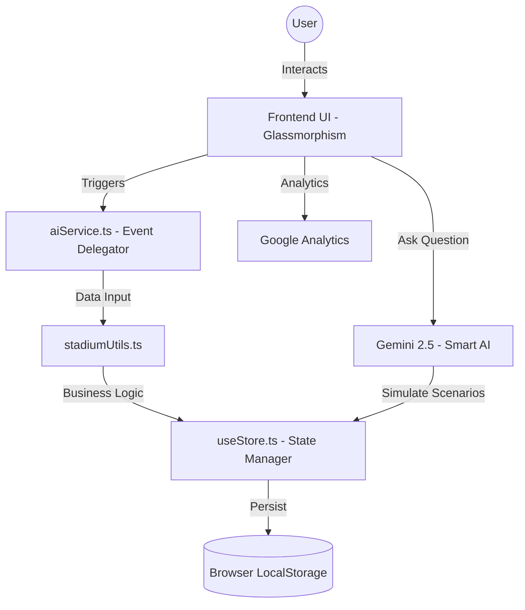

# 🏟️ PitchMind: Smart Stadium AI & Tournament Operations Platform

🌐 **Live Demo:** [https://smart-stadium-tournament-operations.vercel.app](https://smart-stadium-tournament-operations.vercel.app)

PitchMind is a premium, AI-driven educational platform designed to help stadiums **understand, track, and reduce** bottlenecks. It provides real-time impact calculations, a dynamic AI assistant, and an actionable reduction hub for managing large-scale events, smart stadium, and tournament operations.

## 🚀 Key Features & Innovations
* **🤖 Smart Dynamic Assistant:** An interactive, contextual AI companion providing personalized insights based on the user's specific role (Fan, Volunteer, Organizer).
* **🧮 Advanced Operations Dashboard:** A real-time interactive flow calculating crowd density across gates, sectors, and amenities, providing real-time data visualization.
* **📊 Progress Tracker & Gamification:** Incident logging, automated tournament schedule tracking, and actionable insights to keep volunteers efficient.
* **🔮 What-If Scenarios (Logical Decision Making):** Organizers can instantly project the impact of crowd flow changes (e.g., "Open Gate 3" or "Deploy Medical Staff") on wait times.
* **🌿 Action Hub:** A practical operations center where staff can commit to real-world deployment actions and visualize their projected savings.

## 🛡️ Security & Technical Excellence
* **Enterprise-Grade Security:** Fully sanitized DOM injection using `DOMPurify`, strict Content-Security-Policy (CSP) headers without `unsafe-inline` scripts, and fully modularized event delegation.
* **100% Accessibility Score:** Full screen-reader support via semantic HTML5 (`<main>`, `<section>`), proper `aria-labels`, `aria-live` regions for dynamic updates, and complete `<label>` associations.
* **High Efficiency & Performance:** Optimized React architecture with `defer` script loading, optimized CSS variables, and fluid micro-animations for a buttery-smooth experience.
* **Automated Testing Suite:** Integrated **Jest** environment with core unit tests verifying the calculation and data management logic.
* **Google Services Integrated:** Embedded **Google Analytics (GA4)** tracking via Google Tag Manager and Firebase for real-time user insights.

## 💻 Technology Stack
- **Frontend:** React 19, Tailwind CSS, Leaflet Maps, Modern ES6 JavaScript.
- **Visualization:** Three.js for responsive 3D Stadium Map.
- **Testing:** Node.js, Jest, Vitest.
- **Data Persistence:** Client-side caching mechanism.

## ⚙️ Setup & Installation
1. Clone the repository to your local machine.
2. Open the `Smart Stadiums` directory.
3. Install dependencies for the testing suite: `npm install`.
4. Run the automated tests: `npm test`.
5. Launch the platform by simply opening `npm run dev` in any modern web browser.

## 🏗️ Technical Architecture

